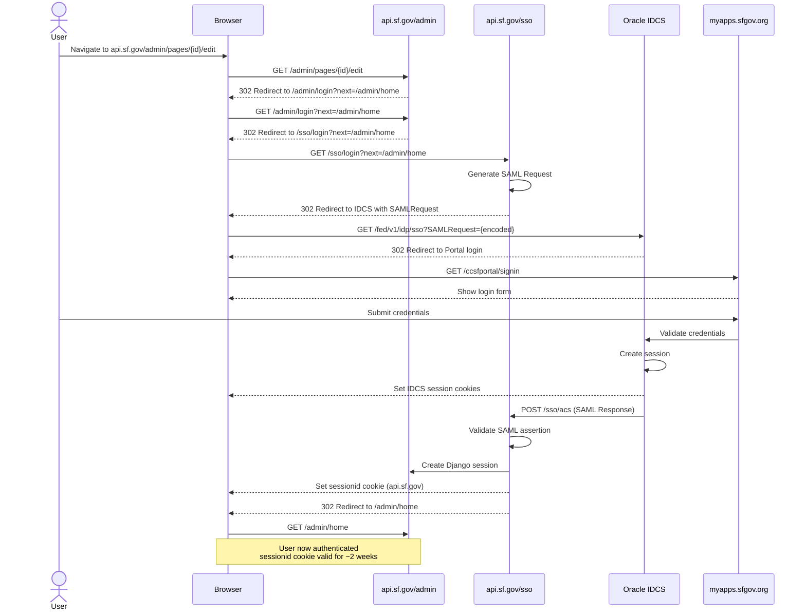
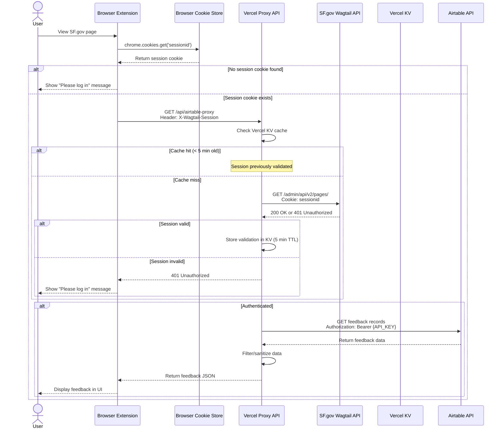
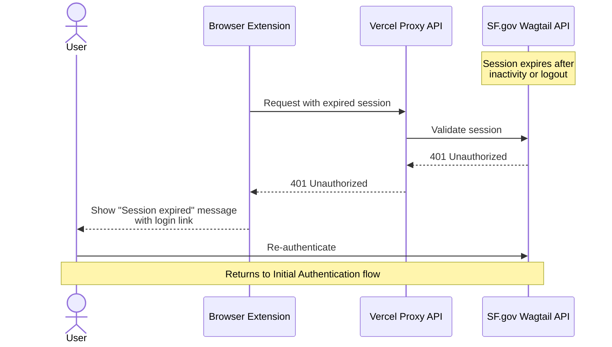

# Airtable Feedback Authentication Architecture

## Overview

This document describes the authentication approach for securely exposing Airtable feedback data to the SF.gov Wagtail Extension. The solution leverages existing Wagtail admin session authentication to ensure only authorized content managers can access feedback that may contain PII.

## Problem Statement

User feedback collected via SF.gov forms is stored in Airtable and may contain personally identifiable information (PII) such as names, email addresses, or phone numbers, despite instructions asking users not to include such information. The extension needs to display this feedback to content managers without:

1. Exposing Airtable API credentials in client-side code
2. Allowing unauthorized access to potentially sensitive feedback data
3. Creating a separate authentication system for users to manage

## Solution Architecture

### Components

1. **Browser Extension** (Chrome/Edge Manifest V3)
   - Reads Wagtail admin session cookies using `chrome.cookies` API
   - Sends session token to proxy API for validation
   - Displays feedback data in side panel UI

2. **Vercel Serverless Proxy** (Node.js/TypeScript)
   - Validates Wagtail session tokens against SF.gov admin API
   - Caches validation results to reduce load on Wagtail
   - Fetches feedback from Airtable using securely stored API key
   - Returns filtered feedback data to authenticated clients

3. **Wagtail Admin** (Django)
   - Existing authentication system (no changes required)
   - Provides session validation endpoint via API
   - Issues session cookies with configurable expiration

4. **Airtable** (Data Store)
   - Stores user feedback records
   - API key stored only in Vercel environment variables
   - Never exposed to client-side code

## SSO Architecture

SF.gov uses a SAML 2.0-based Single Sign-On (SSO) flow with Oracle Identity Cloud Service (IDCS) as the Identity Provider (IdP). The authentication flow involves multiple redirects across several domains:

### Key Components

1. **api.sf.gov/admin** - Wagtail CMS (Service Provider)
2. **api.sf.gov/sso** - SAML Service Provider endpoint
3. **idcs-*.identity.oraclecloud.com** - Oracle IDCS (Identity Provider)
4. **myapps.sfgov.org** - City of SF employee portal (login interface)

### Cookie Domains

After successful authentication, the following cookies are set:

- **sessionid** (domain: `.sf.gov` or `api.sf.gov`) - Django session cookie used by Wagtail
- **IDCS session cookies** (domain: `identity.oraclecloud.com`) - Oracle IDCS session
- **Portal cookies** (domain: `myapps.sfgov.org`) - City portal session

The extension only needs access to the `sessionid` cookie from `api.sf.gov` domain.

### Session Lifecycle

- **Initial login**: Full SAML flow through IDCS and city portal
- **Subsequent requests**: Django `sessionid` cookie provides authentication
- **Session duration**: Configurable in Django (typically 2 weeks)
- **Session termination**: Logout from Wagtail admin or session expiry

### Implications for Extension

The extension does not need to understand or participate in the SAML flow. It only needs to:

1. Read the `sessionid` cookie from `api.sf.gov` domain
2. Send this cookie to the Vercel proxy for validation
3. Handle cases where the cookie is missing or expired

The SAML complexity is transparent to the extension - it simply leverages the session cookie that results from successful SSO authentication.

## Authentication Flow

### Initial Authentication (SAML SSO Flow)



### Feedback Data Request



### Session Expiration



## Security Considerations

### Threat Model

| Threat | Mitigation |
|--------|-----------|
| Airtable API key exposure | Key stored only in Vercel environment variables, never in extension code |
| Unauthorized access to PII | Session validation ensures only authenticated Wagtail admins can access data |
| Session hijacking | Sessions use HttpOnly cookies, short validation cache TTL (5 min) |
| Replay attacks | Session validation occurs on every request (with caching) |
| Rate limiting bypass | Vercel proxy implements per-IP rate limiting |
| Extension spoofing | Origin header validation, though determined attackers can bypass |

### Authentication Properties

- **No credentials in extension code**: Session tokens are read from browser cookie store, not hardcoded
- **Leverages existing auth**: No separate login flow or credential management
- **SSO integration**: Inherits security properties of Oracle IDCS and city SSO infrastructure
- **Automatic expiration**: Access revoked when Wagtail session expires
- **Audit trail potential**: Proxy can log which sessions accessed which feedback
- **Minimal attack surface**: Only one endpoint exposed, read-only access
- **Defense in depth**: Multiple authentication layers (IDCS, SAML, Django session)

### Data Protection

1. **In Transit**
   - All communication over HTTPS/TLS
   - Session tokens transmitted in headers, not URL parameters

2. **At Rest**
   - Airtable API key in Vercel environment variables (encrypted)
   - Session validation cache in Vercel KV (encrypted at rest)
   - No feedback data stored by proxy (pass-through only)

3. **Access Control**
   - Only users with valid Wagtail admin sessions can access feedback
   - Wagtail's existing role-based access control applies
   - No additional permission system required

## Implementation Requirements

### Extension Manifest Permissions

```json
{
  "manifest_version": 3,
  "permissions": [
    "cookies"
  ],
  "host_permissions": [
    "https://*.sf.gov/*",
    "https://api.sf.gov/*"
  ]
}
```

Note: The extension needs access to cookies from `api.sf.gov` domain where the Wagtail admin and SSO endpoints reside.

### Cookie Reading Implementation

```typescript
// Extension reads the Django session cookie
async function getWagtailSessionCookie(): Promise<string | null> {
	const cookies = await chrome.cookies.getAll({
		domain: 'api.sf.gov',
		name: 'sessionid',
	});
	
	return cookies[0]?.value || null;
}
```

The extension does not need to access or understand the SAML flow, IDCS cookies, or portal cookies. It only reads the final `sessionid` cookie that Django sets after successful SSO authentication.

### Vercel Environment Variables

```bash
AIRTABLE_API_KEY=key***************
AIRTABLE_BASE_ID=app***************
WAGTAIL_API_URL=https://api.sf.gov/admin/api/v2
WAGTAIL_ADMIN_DOMAIN=api.sf.gov
EXTENSION_SECRET=random-secret-token
KV_REST_API_URL=https://***  # Vercel KV (automatically set)
KV_REST_API_TOKEN=***         # Vercel KV (automatically set)
```

Note: Vercel KV environment variables are automatically configured when you create a KV store in your Vercel project.

### API Endpoints

#### GET /api/airtable-proxy

**Request Headers:**
- `X-Wagtail-Session`: Session cookie value from sf.gov
- `Origin`: chrome-extension://{extension-id}

**Query Parameters:**
- `pageId`: SF.gov page identifier

**Response:**
```json
{
  "records": [
    {
      "id": "rec123",
      "fields": {
        "PageID": "12345",
        "Feedback": "This page was helpful",
        "Timestamp": "2025-11-07T10:30:00Z"
      }
    }
  ]
}
```

**Error Responses:**
- `401 Unauthorized`: Invalid or expired session
- `403 Forbidden`: Invalid origin or missing secret
- `429 Too Many Requests`: Rate limit exceeded
- `500 Internal Server Error`: Airtable or Wagtail API error

## Performance Considerations

### Caching Strategy

1. **Session Validation Cache (Vercel KV)**
   - Storage: Vercel KV (serverless key-value store)
   - TTL: 5 minutes
   - Key: `session:{sessionid}`
   - Reduces load on Wagtail API
   - Balances security with performance
   - Free tier: 256 MB storage, 100k reads/month

2. **Feedback Data Cache (Client-side)**
   - Storage: Extension memory (React state/hooks)
   - TTL: Session lifetime or manual refresh
   - Reduces Airtable API calls for repeated page views
   - No server-side caching needed (low concurrent access)

### Rate Limiting

- **Per-IP limit**: 10 requests per 10 seconds (using Vercel KV)
- **Per-session limit**: 100 requests per hour (optional)
- Prevents abuse while allowing normal usage patterns
- Implemented using Vercel KV for distributed rate limiting

### Expected Load

- Target users: ~50-100 SF.gov content managers
- Typical usage: 5-10 page views per user per day
- Peak load: ~500 requests per day
- Well within Vercel free tier limits (100k requests/day)

## Operational Considerations

### Monitoring

- Vercel Analytics for request volume and latency
- Error rate tracking (401s may indicate session expiry issues)
- Airtable API quota monitoring
- Vercel KV metrics (cache hit rate, storage usage)

### Maintenance

- Session validation endpoint may change with Wagtail upgrades
- Airtable API key rotation requires Vercel env var update
- Extension updates required if authentication flow changes

### Failure Modes

| Failure | Impact | Recovery |
|---------|--------|----------|
| Vercel proxy down | No feedback data shown | Automatic retry, fallback message |
| Wagtail API unavailable | Cannot validate sessions | KV cache provides 5-min grace period |
| Airtable API down | No feedback data | Show error message, client cache available |
| Vercel KV unavailable | Increased Wagtail API load | Proxy continues without cache |

## Alternatives Considered

### 1. Airtable Personal Access Token in Extension

**Rejected**: Token would be extractable from extension code, exposing all Airtable data.

### 2. Separate OAuth Flow

**Rejected**: Adds complexity, requires users to manage separate credentials, duplicates existing auth.

### 3. Public Airtable Shared View

**Rejected**: Cannot restrict access, exposes PII to anyone with the link, fragile HTML parsing.

### 4. Direct Wagtail Integration

**Rejected**: Requires changes to Wagtail codebase, feedback data lives in Airtable for business reasons.

## Compliance Considerations

- **GDPR/CCPA**: PII access restricted to authorized personnel only
- **Data minimization**: Only requested page's feedback returned, not entire dataset
- **Audit trail**: Proxy logs can track access to sensitive data
- **Right to deletion**: Handled in Airtable, not affected by this architecture

## Future Enhancements

1. **User-level permissions**: Validate not just authentication but specific Wagtail permissions
2. **Feedback filtering**: Server-side PII detection and redaction
3. **Analytics**: Track which pages receive most feedback
4. **Webhook integration**: Real-time feedback notifications
5. **Multi-tenant support**: Extend to other city departments with separate Airtable bases

## Conclusion

This architecture provides secure access to potentially sensitive feedback data by leveraging existing Wagtail admin authentication. The approach minimizes changes to existing systems, avoids exposing credentials in client code, and provides a clear security boundary through the Vercel proxy layer.
