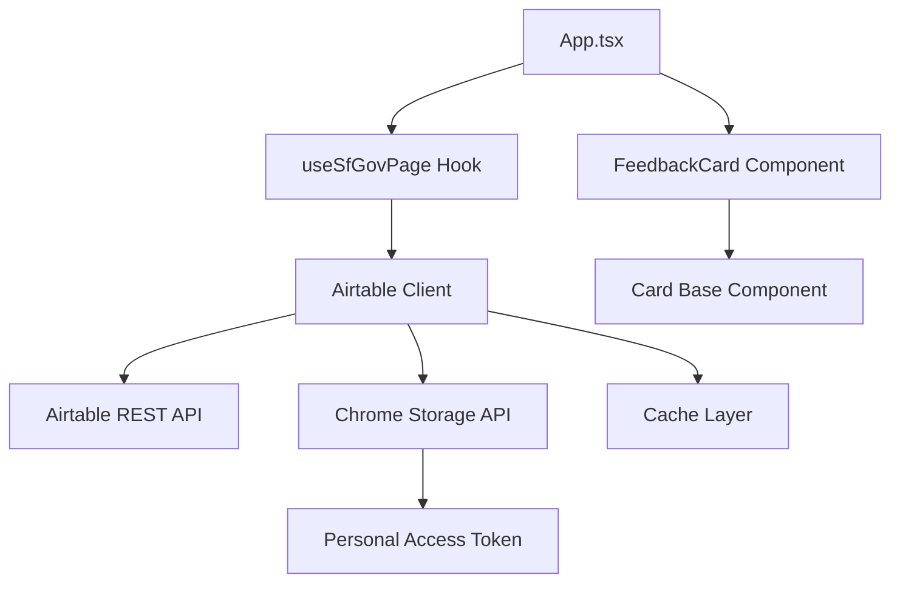

# Design Document

## Overview

This feature integrates Airtable feedback data into the SF.gov Wagtail Extension by creating a new API client for Airtable, TypeScript type definitions for feedback records, and a React card component to display user feedback in the side panel. The implementation follows the existing architecture patterns established by the Wagtail API integration, ensuring consistency and maintainability.

## Architecture

### High-Level Flow

```
User navigates to SF.gov page
    ↓
useSfGovPage hook extracts page path
    ↓
Airtable Client queries Feedback Table
    ↓
Results cached for 5 minutes
    ↓
FeedbackCard displays feedback records
```

### Component Interaction



## Components and Interfaces

### 1. Airtable Client (`src/api/airtable-client.ts`)

The Airtable client module handles all communication with the Airtable REST API, following the same patterns as `wagtail-client.ts`.

#### Key Functions

**`getFeedbackByPath(path: string): Promise<FeedbackRecord[]>`**
- Normalizes the input path (removes trailing slashes, query params)
- Retrieves Personal Access Token from chrome.storage.sync
- Constructs Airtable API URL with filterByFormula
- Implements caching with 5-minute TTL
- Returns up to 5 most recent feedback records sorted by submission date descending
- Throws AirtableApiError on failures

**`getAccessToken(): Promise<string | null>`**
- Retrieves Personal Access Token from chrome.storage.sync
- Returns null if no token is configured

**`setAccessToken(token: string): Promise<void>`**
- Stores Personal Access Token in chrome.storage.sync
- Validates token format before storing

**`normalizePath(path: string): string`**
- Removes query parameters from path
- Removes trailing slashes
- Converts to lowercase for case-insensitive matching
- Handles homepage ("/") as special case

**`fetchWithTimeout(url: string, options: RequestInit, timeout: number): Promise<Response>`**
- Wraps fetch with AbortController for timeout handling
- Default timeout: 10 seconds
- Reused from wagtail-client pattern

#### Caching Strategy

```typescript
interface CacheEntry {
	data: FeedbackRecord[];
	timestamp: number;
}

const feedbackCache = new Map<string, CacheEntry>();
const CACHE_TTL = 5 * 60 * 1000; // 5 minutes
```

Cache key format: `feedback:${normalizedPath}`

#### API Request Format

```
GET https://api.airtable.com/v0/appo4SjothLkSxmbG/Karl%20data
Headers:
  Authorization: Bearer {PERSONAL_ACCESS_TOKEN}
Query Parameters:
  filterByFormula: LOWER({referrer})='{normalizedPath}'
  sort[0][field]: submission_created
  sort[0][direction]: desc
  maxRecords: 5
```

Note: Table name "Karl data" must be URL-encoded as "Karl%20data" in the API request.

#### Error Handling

```typescript
interface AirtableApiError {
	type: 'auth' | 'network' | 'timeout' | 'rate_limit' | 'server_error';
	message: string;
	statusCode?: number;
	retryable: boolean;
}
```

Error mapping:
- 401/403 → `auth` (not retryable)
- 429 → `rate_limit` (retryable with exponential backoff)
- 500/502/503 → `server_error` (retryable)
- Timeout → `timeout` (retryable)
- Network failure → `network` (retryable)

### 2. Type Definitions (`src/types/airtable.ts`)

New TypeScript interfaces for Airtable data structures.

```typescript
/**
 * Represents a user feedback submission from Airtable
 */
export interface FeedbackRecord {
	id: string;
	submissionId: string;
	submissionCreated: string; // ISO 8601 date string
	referrer: string;
	wasHelpful: 'yes' | 'no' | null;
	issueCategory: string | null;
	whatWasHelpful: string | null;
	additionalDetails: string | null;
}

/**
 * Raw Airtable API response structure
 */
export interface AirtableResponse {
	records: AirtableRecord[];
	offset?: string;
}

/**
 * Individual record from Airtable API
 */
export interface AirtableRecord {
	id: string;
	fields: {
		submission_id: string;
		submission_created: string;
		referrer: string;
		wasTheLastPageYouViewedHelpful?: 'yes' | 'no';
		whatWasWrongWithThePage1?: string;
		whatWasHelpful?: string;
		shareMoreDetails?: string;
	};
	createdTime: string;
}

/**
 * Airtable API error structure
 */
export interface AirtableApiError {
	type: 'auth' | 'network' | 'timeout' | 'rate_limit' | 'server_error';
	message: string;
	statusCode?: number;
	retryable: boolean;
}

/**
 * Airtable configuration stored in chrome.storage
 */
export interface AirtableConfig {
	accessToken: string | null;
}
```

### 3. Feedback Card Component (`src/sidepanel/components/FeedbackCard.tsx`)

React component that displays feedback records in the side panel.

#### Props Interface

```typescript
interface FeedbackCardProps {
	pagePath: string;
}
```

#### Component Structure

```tsx
export const FeedbackCard: React.FC<FeedbackCardProps> = ({ pagePath }) => {
	const [feedback, setFeedback] = useState<FeedbackRecord[]>([]);
	const [error, setError] = useState<AirtableApiError | null>(null);
	const [isLoading, setIsLoading] = useState<boolean>(true);
	const [hasToken, setHasToken] = useState<boolean>(false);

	// Fetch feedback on mount and when pagePath changes
	useEffect(() => {
		loadFeedback();
	}, [pagePath]);

	// Render logic based on state
	// ...
}
```

#### UI States

**Loading State**
```tsx
<Card title="User Feedback">
	<div className="flex items-center justify-center py-8">
		<div className="text-sm text-gray-500">Loading feedback...</div>
	</div>
</Card>
```

**No Token Configured**
```tsx
<Card title="User Feedback">
	<div className="text-sm text-gray-600">
		<p>Configure your Airtable access token to view user feedback.</p>
		<button onClick={openSettings} className="mt-2 text-blue-600 hover:underline">
			Configure Token
		</button>
	</div>
</Card>
```

**No Feedback Available**
```tsx
<Card title="User Feedback">
	<div className="text-sm text-gray-500 italic">
		No feedback submitted for this page yet.
	</div>
</Card>
```

**Error State**
```tsx
<Card title="User Feedback">
	<div className="text-sm text-red-600">
		<p>{error.message}</p>
		{error.retryable && (
			<button onClick={retry} className="mt-2 text-blue-600 hover:underline">
				Retry
			</button>
		)}
	</div>
</Card>
```

**Feedback Display**
```tsx
<Card title="User Feedback">
	<div className="space-y-4">
		{feedback.map(record => (
			<FeedbackItem key={record.id} record={record} />
		))}
	</div>
</Card>
```

#### Feedback Item Layout

Each feedback record displays:

```tsx
<div className="border-b border-gray-200 pb-4 last:border-b-0 last:pb-0">
	{/* Header: Date and Helpfulness */}
	<div className="flex items-center justify-between mb-2">
		<div className="text-xs text-gray-500">
			{formatDate(record.submissionCreated)}
		</div>
		<div className={`text-xs font-medium px-2 py-1 rounded ${
			record.wasHelpful === 'yes' 
				? 'bg-green-100 text-green-800' 
				: 'bg-orange-100 text-orange-800'
		}`}>
			{record.wasHelpful === 'yes' ? '👍 Helpful' : '👎 Not Helpful'}
		</div>
	</div>

	{/* Issue Category (if not helpful) */}
	{record.wasHelpful === 'no' && record.issueCategory && (
		<div className="text-sm mb-2">
			<span className="font-medium text-gray-700">Issue: </span>
			<span className="text-gray-900">{record.issueCategory}</span>
		</div>
	)}

	{/* What Was Helpful (if helpful) */}
	{record.wasHelpful === 'yes' && record.whatWasHelpful && (
		<div className="text-sm mb-2">
			<span className="font-medium text-gray-700">What was helpful: </span>
			<span className="text-gray-900">{record.whatWasHelpful}</span>
		</div>
	)}

	{/* Additional Details */}
	{record.additionalDetails && (
		<div className="text-sm">
			<span className="font-medium text-gray-700">Details: </span>
			<span className="text-gray-900">{record.additionalDetails}</span>
		</div>
	)}

	{/* Submission ID (small, at bottom) */}
	<div className="text-xs text-gray-400 mt-2">
		ID: {record.submissionId}
	</div>
</div>
```

### 4. Settings/Configuration UI

Since the extension doesn't currently have an options page, we'll add a simple inline configuration UI within the FeedbackCard when no token is configured.

**Alternative Approach**: Add a minimal options page at `src/options/` following Chrome extension best practices.

For MVP, we'll use inline configuration:

```tsx
const ConfigureToken: React.FC<{ onSave: (token: string) => void }> = ({ onSave }) => {
	const [token, setToken] = useState('');
	const [isSaving, setIsSaving] = useState(false);

	const handleSave = async () => {
		setIsSaving(true);
		await setAccessToken(token);
		onSave(token);
		setIsSaving(false);
	};

	return (
		<div className="space-y-3">
			<p className="text-sm text-gray-600">
				Enter your Airtable Personal Access Token to view user feedback.
			</p>
			<input
				type="password"
				value={token}
				onChange={(e) => setToken(e.target.value)}
				placeholder="pat..."
				className="w-full px-3 py-2 border border-gray-300 rounded text-sm"
			/>
			<button
				onClick={handleSave}
				disabled={!token || isSaving}
				className="px-4 py-2 bg-blue-600 text-white rounded text-sm hover:bg-blue-700 disabled:opacity-50"
			>
				{isSaving ? 'Saving...' : 'Save Token'}
			</button>
		</div>
	);
};
```

### 5. Integration with useSfGovPage Hook

The `useSfGovPage` hook will be extended to extract and provide the current page path for the FeedbackCard.

Add to return type:
```typescript
export interface UseSfGovPageReturn {
	// ... existing fields
	pagePath: string; // e.g., "/new-laguna-honda"
}
```

Path extraction logic (already exists in hook):
```typescript
const pagePath = new URL(currentUrl).pathname;
```

### 6. App.tsx Integration

Add FeedbackCard to the side panel layout:

```tsx
{pageData && (
	<>
		<MetadataCard ... />
		<TranslationsCard ... />
		<MediaAssetsCard ... />
		<FormConfirmationCard ... />
		<FeedbackCard pagePath={pagePath} />
	</>
)}
```

## Data Models

### Airtable Base Configuration

- Base Name: "SF.gov Feedback"
- Base ID: `appo4SjothLkSxmbG`
- Table Name: "Karl data"
- Table ID: `tblbhivrMRm5X8eSU`
- View ID: `viwFDlpPpGrQXV6oR` (not used in API, for reference only)

### Field Mapping

| Airtable Field Name | TypeScript Property | Type | Description |
|---------------------|---------------------|------|-------------|
| `submission_id` | `submissionId` | string | Unique submission identifier |
| `submission_created` | `submissionCreated` | string | ISO 8601 timestamp |
| `referrer` | `referrer` | string | SF.gov page path |
| `wasTheLastPageYouViewedHelpful` | `wasHelpful` | 'yes' \| 'no' \| null | Helpfulness rating |
| `whatWasWrongWithThePage1` | `issueCategory` | string \| null | Issue category (when not helpful) |
| `whatWasHelpful` | `whatWasHelpful` | string \| null | Helpful details (when helpful) |
| `shareMoreDetails` | `additionalDetails` | string \| null | Additional user comments |

## Error Handling

### Error Types and User Messages

| Error Type | User-Facing Message | Retry Available |
|------------|---------------------|-----------------|
| `auth` | "Invalid Airtable access token. Please check your configuration." | No |
| `network` | "Unable to connect to Airtable. Check your network connection." | Yes |
| `timeout` | "Request timed out. Please try again." | Yes |
| `rate_limit` | "Too many requests. Please wait a moment and try again." | Yes (with backoff) |
| `server_error` | "Airtable server error. Please try again later." | Yes |

### Retry Logic

For retryable errors, implement exponential backoff:
- Initial retry: immediate
- Second retry: 2 seconds
- Third retry: 4 seconds
- Max retries: 3

```typescript
async function fetchWithRetry(
	fetchFn: () => Promise<Response>,
	maxRetries: number = 3
): Promise<Response> {
	let lastError: Error;
	
	for (let attempt = 0; attempt < maxRetries; attempt++) {
		try {
			return await fetchFn();
		} catch (error) {
			lastError = error as Error;
			
			// Check if error is retryable
			if (!isRetryableError(error)) {
				throw error;
			}
			
			// Wait before retry (exponential backoff)
			if (attempt < maxRetries - 1) {
				const delay = Math.pow(2, attempt) * 1000;
				await new Promise(resolve => setTimeout(resolve, delay));
			}
		}
	}
	
	throw lastError!;
}
```

## Testing Strategy

### Unit Tests

**Airtable Client Tests** (`src/api/airtable-client.test.ts`)
- Path normalization (trailing slashes, query params, case)
- Cache hit/miss scenarios
- Token retrieval and storage
- Error handling for each error type
- API response parsing

**Type Validation Tests** (`src/types/airtable.test.ts`)
- Validate FeedbackRecord interface matches Airtable schema
- Test field mapping transformations

### Integration Tests

**FeedbackCard Component Tests** (`src/sidepanel/components/FeedbackCard.test.tsx`)
- Renders loading state
- Renders no token state
- Renders no feedback state
- Renders feedback records correctly
- Handles error states
- Retry button functionality
- Token configuration flow

### Manual Testing Checklist

1. Configure valid Airtable token
2. Navigate to SF.gov page with feedback
3. Verify feedback displays correctly
4. Navigate to page without feedback
5. Test with invalid token
6. Test with network disconnected
7. Test cache behavior (navigate away and back within 5 minutes)
8. Test with page paths containing query parameters
9. Test with homepage ("/")
10. Verify 5-record limit on high-traffic pages

## Security Considerations

### Token Storage

- Personal Access Token stored in `chrome.storage.sync`
- Encrypted by Chrome browser
- Never logged to console in production
- Never included in error messages

### API Security

- All requests use HTTPS
- Token sent in Authorization header (not URL)
- No sensitive data cached in localStorage
- Cache cleared on extension uninstall

### Input Validation

- Path normalization prevents injection attacks
- Token format validated before storage
- API responses validated against TypeScript interfaces

## Performance Considerations

### Caching Strategy

- 5-minute TTL balances freshness with API usage
- Cache key includes normalized path
- Cache stored in memory (Map), cleared on extension reload
- Maximum 5 records per page reduces payload size

### Rate Limiting

- Airtable free tier: 5 requests/second per base
- Extension makes 1 request per page navigation
- Caching reduces redundant requests
- Exponential backoff on rate limit errors

### Bundle Size

- Airtable client adds ~2KB (gzipped)
- No external dependencies required
- Reuses existing fetch and Chrome APIs

## Future Enhancements

1. **Feedback Aggregation**: Show summary statistics (% helpful, common issues)
2. **Filtering**: Filter by date range or helpfulness
3. **Export**: Download feedback as CSV
4. **Notifications**: Alert when new feedback arrives
5. **Multi-base Support**: Configure multiple Airtable bases
6. **OAuth Integration**: Replace Personal Access Token with OAuth flow
7. **Offline Support**: Queue requests when offline, sync when online
