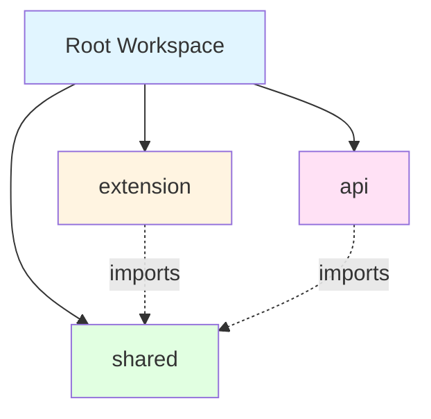
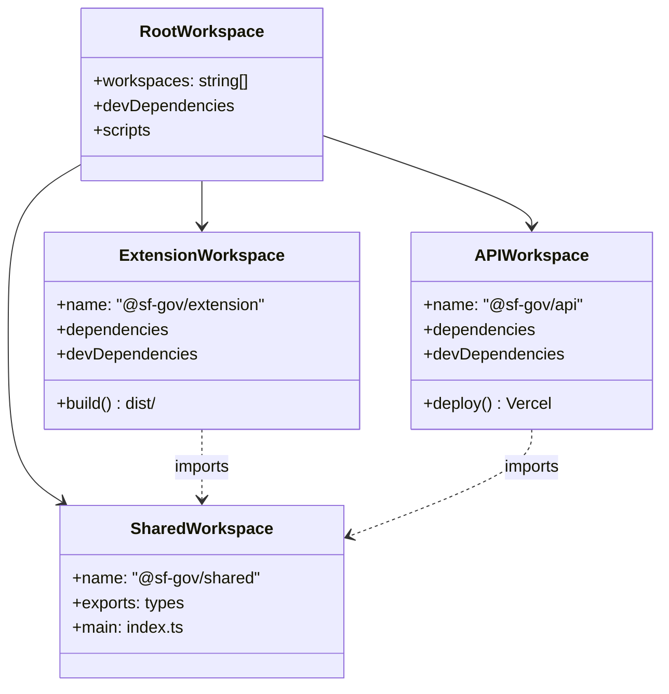

# Monorepo Conversion Design

## Overview

This design document outlines the conversion of the SF.gov Wagtail Extension from a single-package project to an npm workspaces-based monorepo with three packages: `extension`, `api`, and `shared`. The monorepo structure enables independent development and deployment of the browser extension and Vercel API while maintaining shared type definitions. Each package uses its optimal build tool: Vite for the extension and Vercel's build system (Turbopack) for the API.

## Architecture

### Directory Structure

**Current Structure** (before conversion):
```
sf-gov-companion/
├── src/                       # Extension source code
├── public/                    # Extension public assets
├── .kiro/                     # Kiro configuration
├── package.json               # Extension dependencies
├── vite.config.ts             # Vite configuration
├── tsconfig.json              # TypeScript configuration
├── tailwind.config.ts         # Tailwind configuration
├── manifest.config.ts         # Extension manifest
└── ...
```

**Target Structure** (after conversion):
```
sf-gov-companion/              # Root directory (unchanged path)
├── packages/
│   ├── extension/             # Browser extension workspace (moved from root)
│   │   ├── src/               # Moved from ./src/
│   │   │   ├── api/
│   │   │   ├── background/
│   │   │   ├── sidepanel/
│   │   │   ├── content/
│   │   │   └── assets/
│   │   ├── public/            # Moved from ./public/
│   │   ├── dist/              # Build output
│   │   ├── release/           # Packaged extensions
│   │   ├── package.json       # Moved from ./package.json (modified)
│   │   ├── tsconfig.json      # Moved from ./tsconfig.json (modified)
│   │   ├── vite.config.ts     # Moved from ./vite.config.ts (modified)
│   │   ├── tailwind.config.ts # Moved from ./tailwind.config.ts
│   │   └── manifest.config.ts # Moved from ./manifest.config.ts
│   │
│   ├── api/                   # Vercel API workspace (new)
│   │   ├── api/
│   │   │   └── airtable-proxy.ts
│   │   ├── lib/
│   │   ├── package.json
│   │   ├── tsconfig.json
│   │   └── vercel.json
│   │
│   └── shared/                # Shared types workspace (new)
│       ├── src/
│       │   ├── types/
│       │   │   ├── wagtail.ts    # Extracted from extension
│       │   │   ├── airtable.ts   # Extracted from extension
│       │   │   └── index.ts
│       │   └── index.ts
│       ├── package.json
│       └── tsconfig.json
│
├── .kiro/                     # Kiro configuration (unchanged location)
├── node_modules/              # Hoisted dependencies
├── package.json               # New root workspace config
├── tsconfig.json              # New root TypeScript config
├── .gitignore                 # Updated
└── README.md                  # Updated
```

**Key Changes**:
- Root directory path remains where it is
- Most current root files move into `packages/extension/`
- `.kiro/` directory stays at root (unchanged)
- New root `package.json` for workspace management
- New `packages/api/` and `packages/shared/` directories

### Workspace Relationships



## Components and Interfaces

### 1. Root Workspace

**Purpose**: Orchestrate builds, manage shared dependencies, and provide top-level scripts.

**Files**:
- `package.json`: Defines workspaces, shared dependencies, and orchestration scripts
- `tsconfig.json`: Base TypeScript configuration

**Key Configuration** (`package.json`):
```json
{
  "name": "sf-gov-wagtail-extension-monorepo",
  "private": true,
  "workspaces": [
    "packages/*"
  ],
  "scripts": {
    "dev": "npm run dev --workspaces --if-present",
    "dev:extension": "npm run dev --workspace=@sf-gov/extension",
    "dev:api": "npm run dev --workspace=@sf-gov/api",
    "build": "npm run build --workspaces --if-present",
    "build:extension": "npm run build --workspace=@sf-gov/extension",
    "build:api": "npm run build --workspace=@sf-gov/api",
    "type-check": "npm run type-check --workspaces --if-present"
  },
  "devDependencies": {
    "typescript": "^5.9.0"
  }
}
```

**Notes**:
- npm workspaces handles dependency hoisting automatically
- `--if-present` flag skips workspaces that don't have the script
- `--workspace` flag targets specific packages
- No additional build orchestration tool needed

### 2. Extension Workspace

**Purpose**: Browser extension code with Vite build system.

**Package Name**: `@sf-gov/extension`

**Key Dependencies**:
- `@sf-gov/shared` (workspace dependency)
- `react`, `react-dom`
- `vite`, `@crxjs/vite-plugin`
- `tailwindcss`

**Build Output**: `packages/extension/dist/` and `packages/extension/release/`

**Import Pattern**:
```typescript
// Import from shared workspace
import type { WagtailPage, AirtableRecord } from '@sf-gov/shared';
```

**Scripts** (`packages/extension/package.json`):
```json
{
  "name": "@sf-gov/extension",
  "type": "module",
  "version": "0.0.4",
  "private": true,
  "scripts": {
    "dev": "vite",
    "build": "tsc -b && vite build",
    "preview": "vite preview",
    "release": "tsc -b && npm version patch && vite build",
    "type-check": "tsc --noEmit"
  },
  "dependencies": {
    "@sf-gov/shared": "*",
    "react": "^19.2.0",
    "react-dom": "^19.2.0"
  },
  "devDependencies": {
    "@crxjs/vite-plugin": "^2.2.1",
    "@tailwindcss/vite": "^4.1.16",
    "@types/chrome": "^0.1.27",
    "@types/node": "^24.9.2",
    "@types/react": "^19.2.2",
    "@types/react-dom": "^19.2.2",
    "@vitejs/plugin-react": "^5.1.0",
    "tailwindcss": "^4.1.16",
    "typescript": "~5.9.3",
    "vite": "^7.1.12",
    "vite-plugin-zip-pack": "^1.2.4"
  }
}
```

**Note**: All existing scripts (`dev`, `build`, `preview`, `release`) are preserved. The only addition is the `@sf-gov/shared` workspace dependency.

### 3. API Workspace

**Purpose**: Vercel serverless functions for Airtable proxy.

**Package Name**: `@sf-gov/api`

**Key Dependencies**:
- `@sf-gov/shared` (workspace dependency)
- `@vercel/node`
- `@vercel/kv`

**Deployment**: Vercel (independent from extension)

**Import Pattern**:
```typescript
// Import from shared workspace
import type { AirtableRecord, AirtableFeedbackFields } from '@sf-gov/shared';
```

**Scripts** (`packages/api/package.json`):
```json
{
  "name": "@sf-gov/api",
  "version": "1.0.0",
  "scripts": {
    "dev": "vercel dev",
    "build": "vercel build",
    "deploy": "vercel --prod",
    "type-check": "tsc --noEmit"
  }
}
```

**Vercel Configuration** (`packages/api/vercel.json`):
```json
{
  "version": 2,
  "buildCommand": "npm run build --filter=api",
  "devCommand": "npm run dev --filter=api",
  "installCommand": "npm install",
  "framework": null,
  "outputDirectory": ".vercel/output"
}
```

### 4. Shared Workspace

**Purpose**: Common TypeScript types and utilities.

**Package Name**: `@sf-gov/shared`

**Exports**:
- Wagtail API types
- Airtable API types
- Common utility types

**Structure**:
```typescript
// packages/shared/src/types/wagtail.ts
export interface WagtailPage {
  id: number;
  title: string;
  // ... other fields
}

// packages/shared/src/types/airtable.ts
export interface AirtableRecord {
  id: string;
  fields: AirtableFeedbackFields;
}

export interface AirtableFeedbackFields {
  PageID: string;
  Feedback: string;
  Timestamp: string;
}

// packages/shared/src/index.ts
export * from './types/wagtail';
export * from './types/airtable';
```

**Package Configuration** (`packages/shared/package.json`):
```json
{
  "name": "@sf-gov/shared",
  "version": "1.0.0",
  "main": "./src/index.ts",
  "types": "./src/index.ts",
  "exports": {
    ".": "./src/index.ts"
  },
  "scripts": {
    "type-check": "tsc --noEmit"
  }
}
```

## Data Models

### Workspace Dependencies



## Error Handling

### Build Errors

1. **Workspace dependency resolution failure**
   - Error: Cannot resolve `@sf-gov/shared`
   - Solution: Ensure `npm install` runs at root to link workspaces

2. **Type checking failures**
   - Error: Types not found from shared workspace
   - Solution: Verify `tsconfig.json` workspace references are correct

3. **Circular dependencies**
   - Error: Circular dependency detected
   - Solution: Shared workspace should not import from extension or API

### Development Errors

1. **Port conflicts**
   - Error: Port already in use
   - Solution: Configure different ports for extension (5173) and API (3000)

2. **Hot reload issues**
   - Error: Changes not reflected
   - Solution: Restart the specific workspace dev server

## Testing Strategy

### Unit Testing

- **Extension**: Test React components and hooks
- **API**: Test serverless function logic
- **Shared**: Test type exports and utilities

### Integration Testing

- **Extension + API**: Test end-to-end authentication flow
- **Type Safety**: Verify shared types work across workspaces

### Build Testing

- **Turborepo Pipeline**: Verify build order and caching
- **Workspace Isolation**: Ensure workspaces build independently

## Migration Strategy

### Phase 1: Setup Monorepo Structure

1. Create `./packages/` directory at root
2. Create workspace directories: `./packages/extension/`, `./packages/api/`, `./packages/shared/`
3. Backup current root `package.json` (will be moved to extension)
4. Create new root `./package.json` with workspace configuration
5. Create new root `./tsconfig.json` for base configuration
6. Update `./.gitignore` to handle monorepo structure

### Phase 2: Migrate Extension Code

1. Move `./src/` to `./packages/extension/src/`
2. Move `./public/` to `./packages/extension/public/`
3. Move `./dist/` to `./packages/extension/dist/` (if exists)
4. Move `./release/` to `./packages/extension/release/` (if exists)
5. Move config files to `./packages/extension/`:
   - `package.json` (will be modified)
   - `vite.config.ts`
   - `tsconfig.json` (will be modified)
   - `tailwind.config.ts`
   - `manifest.config.ts`
6. Update `package.json` name to `@sf-gov/extension`
7. Update import paths in extension code

### Phase 3: Create Shared Package

1. Create `./packages/shared/` directory structure
2. Extract types from `./packages/extension/src/types/` to `./packages/shared/src/types/`
3. Create `./packages/shared/package.json`
4. Create `./packages/shared/tsconfig.json`
5. Export types from `./packages/shared/src/index.ts`

### Phase 4: Create API Package

1. Create `./packages/api/` directory structure
2. Create `./packages/api/api/` directory for serverless functions
3. Add `./packages/api/api/airtable-proxy.ts` serverless function
4. Create `./packages/api/lib/` for utility functions
5. Create `./packages/api/package.json`
6. Create `./packages/api/tsconfig.json`
7. Create `./packages/api/vercel.json`
8. Add Vercel KV integration

### Phase 5: Update Dependencies

1. Update extension to import from `@sf-gov/shared`
2. Update API to import from `@sf-gov/shared`
3. Run `npm install` at root to link workspaces
4. Verify builds work

### Phase 6: Update Documentation

1. Update root README with monorepo instructions
2. Update steering rules with new structure
3. Document workspace-specific commands

## Performance Considerations

### Build Performance

- **npm Workspaces**: Hoists common dependencies to reduce installation time
- **Independent Builds**: Each package builds with its optimal tool (Vite or Vercel)
- **Parallel Execution**: npm workspaces runs scripts in parallel by default when using `--workspaces`

### Development Performance

- **Workspace Isolation**: Changes in API don't trigger extension rebuilds
- **Vite HMR**: Extension retains fast hot module replacement
- **Vercel Dev**: API functions reload quickly during development
- **Turbopack**: Vercel automatically uses Turbopack for fast API builds

## Deployment Strategy

### Extension Deployment

1. Build: `npm run build:extension`
2. Output: `packages/extension/dist/` and `packages/extension/release/`
3. Distribution: Chrome Web Store, Edge Add-ons

### API Deployment

1. Build: `npm run build:api` (or automatic via Vercel)
2. Deploy: `cd packages/api && vercel --prod`
3. Environment: Vercel serverless functions

### Independent Versioning

- Extension and API maintain separate version numbers
- Extension updates don't require API redeployment
- API updates don't require extension resubmission

## Security Considerations

### Workspace Isolation

- API secrets never accessible to extension code
- Extension code never deployed to Vercel
- Shared package contains only types (no secrets)

### Dependency Management

- Each workspace declares its own dependencies
- Minimize shared dependencies to reduce attack surface
- Regular dependency audits per workspace

## Future Enhancements

1. **Shared UI Components**: Create `@sf-gov/ui` workspace for reusable React components
2. **E2E Testing Workspace**: Add `@sf-gov/e2e` for Playwright tests
3. **Documentation Workspace**: Add `@sf-gov/docs` for Docusaurus site
4. **Changesets**: Add changesets for automated versioning and changelogs
5. **Build Orchestration**: Consider adding Turborepo if build complexity increases
