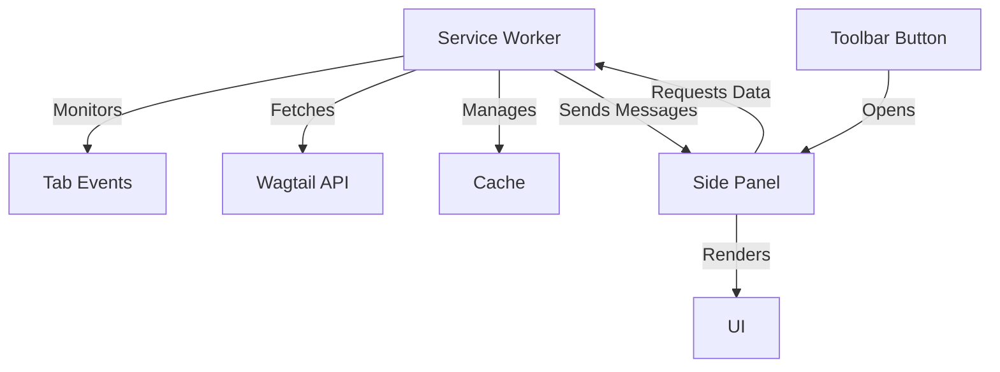
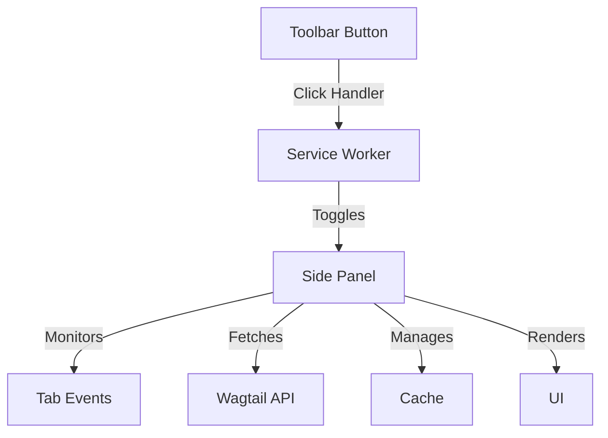

# Design Document

## Overview

This design refactors the Chrome extension architecture to move tab monitoring, URL detection, API fetching, and caching logic from the background service worker to the side panel. The service worker will be simplified to only handle toolbar button clicks that toggle the side panel open/closed. The side panel will become self-sufficient, managing its own lifecycle, data fetching, and event listeners.

### Key Benefits

- **Reduced background processing**: Service worker only runs when toolbar button is clicked
- **Simpler architecture**: Clear separation of concerns between UI and background
- **Better resource management**: Tab monitoring only occurs when side panel is open
- **Improved maintainability**: Related functionality is colocated in the side panel

## Architecture

### Current Architecture



### New Architecture



## Components and Interfaces

### Service Worker (Simplified)

**File**: `src/background/service-worker.ts`

**Responsibilities**:
- Handle toolbar button clicks
- Toggle side panel open/closed state

**Removed Functionality**:
- Tab event monitoring (`chrome.tabs.onUpdated`, `chrome.tabs.onActivated`)
- URL detection and slug extraction
- API data fetching
- Cache management
- Message handling for page data requests
- Tab state tracking
- Debounce timers

**New Implementation**:

```typescript
// Minimal service worker
chrome.runtime.onInstalled.addListener(() => {
  console.log('SF.gov Wagtail Extension installed');
});

chrome.action.onClicked.addListener(async (tab) => {
  if (tab.id) {
    try {
      // Check if side panel is already open
      // Chrome doesn't provide a direct API to check this,
      // so we'll use sidePanel.open() which toggles by default
      await chrome.sidePanel.open({ tabId: tab.id });
      console.log('Side panel toggled via toolbar button');
    } catch (error) {
      console.error('Error toggling side panel:', error);
    }
  }
});
```

### Side Panel (Enhanced)

**File**: `src/sidepanel/sidepanel.ts`

**New Responsibilities**:
- Monitor tab navigation when panel is open
- Detect SF.gov URLs and extract slugs
- Fetch data from Wagtail API
- Manage page data cache
- Debounce rapid navigation changes
- Clean up resources when panel closes

**New Interfaces**:

```typescript
interface TabState {
  url: string;
  slug: string;
  isOnSfGov: boolean;
}

interface CacheEntry {
  data: WagtailPage | null;
  error?: ApiError;
  timestamp: number;
}

interface SidePanelManager {
  // Lifecycle
  initialize(): void;
  cleanup(): void;
  
  // Tab monitoring
  setupTabListeners(): void;
  removeTabListeners(): void;
  handleTabUpdate(tabId: number, url: string): Promise<void>;
  handleTabActivated(tabId: number): Promise<void>;
  
  // URL detection
  isOnSfGov(url: string): boolean;
  extractPageSlug(url: string): string;
  
  // Data fetching
  fetchPageData(slug: string): Promise<void>;
  
  // Cache management
  getCachedData(slug: string): CacheEntry | null;
  setCachedData(slug: string, entry: CacheEntry): void;
  isCacheValid(entry: CacheEntry): boolean;
  clearCache(): void;
  
  // Debouncing
  debounce(fn: Function, delay: number): Function;
}
```

## Data Models

### Cache Structure

The side panel will maintain an in-memory cache using a `Map`:

```typescript
const pageCache = new Map<string, CacheEntry>();
const CACHE_TTL = 5 * 60 * 1000; // 5 minutes
```

**Cache Entry**:
```typescript
interface CacheEntry {
  data: WagtailPage | null;  // Null if error occurred
  error?: ApiError;           // Present if fetch failed
  timestamp: number;          // Unix timestamp in milliseconds
}
```

### Tab State

Track current tab to avoid redundant operations:

```typescript
interface TabState {
  url: string;        // Full URL of the tab
  slug: string;       // Extracted page slug
  isOnSfGov: boolean; // Whether URL is on SF.gov domain
}

let currentTabState: TabState | null = null;
```

### Debounce State

```typescript
let debounceTimer: number | null = null;
const DEBOUNCE_DELAY = 300; // milliseconds
```

## Implementation Details

### 1. Side Panel Initialization

When the side panel opens:

1. Call `initialize()` to set up the panel
2. Set up tab event listeners
3. Query current active tab
4. Check if current tab is on SF.gov
5. If yes, extract slug and fetch data
6. If no, show appropriate message

```typescript
function initialize(): void {
  console.log('Side panel initialized');
  
  // Set up tab listeners
  setupTabListeners();
  
  // Load current page data
  loadCurrentPage();
  
  // Set up retry button
  setupRetryButton();
  
  // Set up cleanup on unload
  window.addEventListener('beforeunload', cleanup);
}
```

### 2. Tab Event Monitoring

The side panel will listen to Chrome tab events:

```typescript
function setupTabListeners(): void {
  chrome.tabs.onUpdated.addListener(onTabUpdated);
  chrome.tabs.onActivated.addListener(onTabActivated);
}

function removeTabListeners(): void {
  chrome.tabs.onUpdated.removeListener(onTabUpdated);
  chrome.tabs.onActivated.removeListener(onTabActivated);
}

const onTabUpdated = (tabId: number, changeInfo: chrome.tabs.TabChangeInfo, tab: chrome.tabs.Tab) => {
  if (changeInfo.status === 'complete' && tab.url) {
    handleTabUpdate(tabId, tab.url);
  }
};

const onTabActivated = async (activeInfo: chrome.tabs.TabActiveInfo) => {
  const tab = await chrome.tabs.get(activeInfo.tabId);
  if (tab.url) {
    handleTabUpdate(activeInfo.tabId, tab.url);
  }
};
```

### 3. URL Detection and Slug Extraction

Move these utility functions from service worker to side panel:

```typescript
function isOnSfGov(url: string): boolean {
  try {
    const urlObj = new URL(url);
    return urlObj.hostname.includes('sf.gov');
  } catch (error) {
    return false;
  }
}

function extractPageSlug(url: string): string {
  try {
    const urlObj = new URL(url);
    let pathname = urlObj.pathname;
    
    // Remove trailing slash
    if (pathname.endsWith('/')) {
      pathname = pathname.slice(0, -1);
    }
    
    // Remove leading slash
    if (pathname.startsWith('/')) {
      pathname = pathname.slice(1);
    }
    
    return pathname;
  } catch (error) {
    return '';
  }
}
```

### 4. Data Fetching with Debouncing

Implement debounced data fetching:

```typescript
async function handleTabUpdate(tabId: number, url: string): Promise<void> {
  const onSfGov = isOnSfGov(url);
  const slug = onSfGov ? extractPageSlug(url) : '';
  
  // Check if state changed
  const stateChanged = !currentTabState || 
                       currentTabState.url !== url || 
                       currentTabState.slug !== slug ||
                       currentTabState.isOnSfGov !== onSfGov;
  
  if (!stateChanged) {
    return; // No change, skip processing
  }
  
  // Update current state
  currentTabState = { url, slug, isOnSfGov: onSfGov };
  
  if (onSfGov && slug) {
    // Debounce the fetch
    debouncedFetchPageData(slug);
  } else {
    // Clear UI and show appropriate message
    showNotOnSfGov();
  }
}

const debouncedFetchPageData = (() => {
  let timer: number | null = null;
  
  return (slug: string) => {
    if (timer) {
      clearTimeout(timer);
    }
    
    timer = setTimeout(() => {
      timer = null;
      fetchPageData(slug);
    }, DEBOUNCE_DELAY);
  };
})();
```

### 5. Cache Management

Implement caching logic in the side panel:

```typescript
const pageCache = new Map<string, CacheEntry>();
const CACHE_TTL = 5 * 60 * 1000; // 5 minutes

function getCachedData(slug: string): CacheEntry | null {
  const entry = pageCache.get(slug);
  if (entry && isCacheValid(entry)) {
    return entry;
  }
  return null;
}

function setCachedData(slug: string, entry: CacheEntry): void {
  pageCache.set(slug, entry);
}

function isCacheValid(entry: CacheEntry): boolean {
  return Date.now() - entry.timestamp < CACHE_TTL;
}

function clearCache(): void {
  pageCache.clear();
}

async function fetchPageData(slug: string): Promise<void> {
  // Check cache first
  const cachedEntry = getCachedData(slug);
  if (cachedEntry) {
    console.log('Using cached data for slug:', slug);
    renderPageData(cachedEntry.data, cachedEntry.error);
    return;
  }
  
  // Show loading state
  showLoading();
  
  // Fetch from API
  try {
    console.log('Fetching page data for slug:', slug);
    const pageData = await findPageBySlug(slug);
    
    // Cache the result
    setCachedData(slug, {
      data: pageData,
      timestamp: Date.now()
    });
    
    // Render the data
    if (pageData) {
      renderPageData(pageData);
    } else {
      showError({
        type: 'not_found',
        message: 'This page is not found in the CMS',
        retryable: false
      });
    }
  } catch (error) {
    console.error('Error fetching page data:', error);
    
    const apiError = error as ApiError;
    if (apiError && apiError.type && apiError.message) {
      // Cache non-retryable errors
      if (!apiError.retryable) {
        setCachedData(slug, {
          data: null,
          error: apiError,
          timestamp: Date.now()
        });
      }
      
      showError(apiError);
    } else {
      showError({
        type: 'network',
        message: 'An unexpected error occurred',
        retryable: true
      });
    }
  }
}
```

### 6. Cleanup on Panel Close

Ensure proper resource cleanup:

```typescript
function cleanup(): void {
  console.log('Side panel cleaning up');
  
  // Remove tab listeners
  removeTabListeners();
  
  // Clear debounce timer
  if (debounceTimer) {
    clearTimeout(debounceTimer);
    debounceTimer = null;
  }
  
  // Note: We keep the cache in memory for when panel reopens
  // Cache will be cleared when extension reloads
}

// Set up cleanup on window unload
window.addEventListener('beforeunload', cleanup);
```

### 7. Retry Functionality

Update retry to work without service worker:

```typescript
function handleRetryClick(): void {
  if (!currentTabState || !currentTabState.slug) {
    console.error('No slug available for retry');
    return;
  }
  
  // Clear cache for this slug
  pageCache.delete(currentTabState.slug);
  
  // Fetch fresh data
  fetchPageData(currentTabState.slug);
}
```

## Error Handling

### Side Panel Error Scenarios

1. **Panel opens on non-SF.gov page**: Show informational message "Navigate to an SF.gov page to see CMS information"
2. **API fetch fails**: Display error with retry button (if retryable)
3. **Network timeout**: Show timeout error with retry button
4. **Page not found (404)**: Show "Page not found in CMS" without retry button
5. **Tab API errors**: Log to console, gracefully degrade functionality

### Service Worker Error Scenarios

1. **Side panel fails to open**: Log error to console, no user-facing impact
2. **Extension installation fails**: Chrome handles this automatically

## Testing Strategy

### Unit Tests

**Side Panel Functions**:
- `isOnSfGov()` - Test with various URLs (SF.gov, non-SF.gov, invalid)
- `extractPageSlug()` - Test slug extraction with different URL formats
- `isCacheValid()` - Test with fresh and expired cache entries
- `getCachedData()` - Test cache hits and misses
- Debounce logic - Test that rapid calls are properly debounced

**Service Worker**:
- Toolbar button click handler - Verify side panel toggle

### Integration Tests

1. **Panel opens and loads current page**:
   - Open panel on SF.gov page
   - Verify data is fetched and displayed
   - Verify loading state appears then disappears

2. **Tab navigation while panel is open**:
   - Open panel on SF.gov page A
   - Navigate to SF.gov page B
   - Verify panel updates with page B data

3. **Tab switching while panel is open**:
   - Open panel with tab A active (SF.gov)
   - Switch to tab B (different SF.gov page)
   - Verify panel updates with tab B data

4. **Cache functionality**:
   - Load page A (cache miss)
   - Navigate away and back to page A (cache hit)
   - Verify no duplicate API calls

5. **Retry functionality**:
   - Trigger an error state
   - Click retry button
   - Verify fresh data is fetched

6. **Panel close cleanup**:
   - Open panel and verify listeners are active
   - Close panel
   - Verify listeners are removed (check Chrome DevTools)

### Manual Testing

1. Test toolbar button toggle behavior
2. Test rapid tab switching (verify debouncing)
3. Test with slow network (verify loading states)
4. Test with API errors (verify error states)
5. Test cache expiration (wait 5+ minutes)
6. Test on non-SF.gov pages (verify appropriate message)

## Migration Notes

### Breaking Changes

- Service worker no longer sends `PAGE_DATA` messages
- Service worker no longer responds to `GET_CURRENT_PAGE` messages
- Service worker no longer handles `RETRY_FETCH` messages

### Message Types to Remove

Since the side panel will be self-contained, these message types are no longer needed:
- `GetCurrentPageMessage` - Side panel queries tabs directly
- `RetryMessage` - Side panel handles retry internally
- `PageDataMessage` - No longer sent between components

The `ExtensionMessage` union type can be removed entirely.

### Backward Compatibility

This is a breaking change that requires updating both service worker and side panel simultaneously. No backward compatibility is needed since this is an internal refactoring.

## Performance Considerations

### Memory Usage

- **Cache size**: Limited by number of unique pages visited while panel is open
- **Cache cleanup**: Cache persists until extension reloads (acceptable for typical usage)
- **Listener cleanup**: Proper cleanup prevents memory leaks

### Network Usage

- **Debouncing**: 300ms delay prevents excessive API calls during rapid navigation
- **Caching**: 5-minute TTL reduces redundant API calls
- **Conditional fetching**: Only fetch when on SF.gov pages

### CPU Usage

- **Event listeners**: Only active when panel is open
- **No background processing**: Service worker is idle except during toolbar clicks
- **Efficient state tracking**: Avoid redundant operations with state comparison

## Security Considerations

- No changes to security model
- API calls still use HTTPS
- No sensitive data stored in cache
- Cache is in-memory only (cleared on extension reload)
