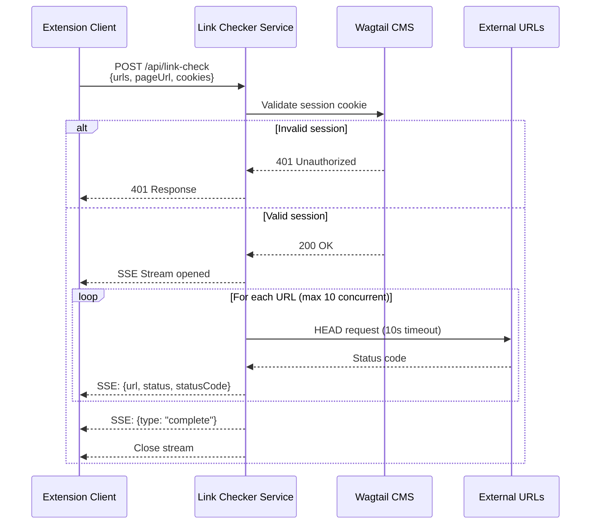

# Design Document: Server-Side Link Checking

## Overview

This design implements a server-side link checking system that overcomes CORS limitations of the current client-side implementation. The system uses a Vercel serverless function to validate links with proper authentication, streaming results back to the client using Server-Sent Events (SSE) for real-time feedback.

The architecture consists of three main components:
1. **Link Checker Service** - Vercel serverless function (`/api/link-check`) that validates URLs
2. **Extension Client** - Browser extension UI that initiates checks and displays results
3. **Authentication Layer** - Wagtail session validation to prevent abuse

## Architecture

### High-Level Flow



### Component Interaction

The system follows a request-response-stream pattern:
1. Client sends batch of URLs with authentication
2. Service validates authentication synchronously
3. Service opens SSE stream and validates links asynchronously
4. Client receives and displays results incrementally
5. Service closes stream when complete or on error

## Components and Interfaces

### 1. Link Checker Service (`/api/link-check.ts`)

**Responsibilities:**
- Validate Wagtail session authentication
- Parse and validate request payload
- Stream link validation results via SSE
- Handle rate limiting and concurrency
- Detect client disconnection

**Interface:**

```typescript
// Request
interface LinkCheckRequest {
	urls: string[];          // URLs to validate (max 200)
	pageUrl: string;         // Source page URL for context
}

// Response (SSE events)
interface LinkCheckResultEvent {
	url: string;
	status: "ok" | "broken" | "redirect" | "timeout" | "error" | "insecure";
	statusCode?: number;
	finalUrl?: string;       // For redirects
	error?: string;          // For errors
}

interface LinkCheckCompleteEvent {
	type: "complete";
	total: number;
	checked: number;
}

interface LinkCheckErrorEvent {
	type: "error";
	message: string;
}
```

**Key Functions:**

```typescript
// Main handler
async function handler(req: VercelRequest, res: VercelResponse): Promise<void>

// Authentication
async function validateWagtailSession(cookies: string): Promise<boolean>

// Link validation
async function checkLink(url: string, pageUrl: string): Promise<LinkCheckResultEvent>

// Stream management
function sendSSE(res: VercelResponse, data: object): void
function closeSSE(res: VercelResponse): void
```

### 2. Extension Client Updates

**New API Client (`/api/link-check-client.ts`):**

```typescript
interface LinkCheckClientOptions {
	urls: string[];
	pageUrl: string;
	onResult: (result: LinkCheckResultEvent) => void;
	onComplete: (summary: LinkCheckCompleteEvent) => void;
	onError: (error: string) => void;
}

class LinkCheckClient {
	private eventSource: EventSource | null = null;
	private abortController: AbortController;

	async startCheck(options: LinkCheckClientOptions): Promise<void>;
	abort(): void;
}
```

**Updated LinkCheckerCard Component:**

```typescript
// Replace chrome.scripting.executeScript with server API call
const handleRunCheck = async () => {
	const client = new LinkCheckClient();
	
	await client.startCheck({
		urls: links.map(l => l.url),
		pageUrl: currentPageUrl,
		onResult: (result) => {
			// Update UI incrementally
			setResults(prev => [...prev, result]);
			setProgress(prev => ({ ...prev, checked: prev.checked + 1 }));
		},
		onComplete: (summary) => {
			setHasRun(true);
			setIsLoading(false);
			setCachedResults(pageUrl, results);
		},
		onError: (error) => {
			setError(error);
			setIsLoading(false);
		}
	});
};
```

### 3. Authentication Layer

**Wagtail Session Validation:**

The service validates sessions by making a request to the Wagtail admin API with the provided cookies. This approach:
- Leverages existing Wagtail authentication
- Requires no additional user management
- Works with existing session cookies from the extension

```typescript
async function validateWagtailSession(cookieHeader: string): Promise<boolean> {
	try {
		const response = await fetch(`${WAGTAIL_BASE_URL}/admin/api/main/pages/`, {
			method: "HEAD",
			headers: {
				"Cookie": cookieHeader,
			},
		});
		return response.status === 200;
	} catch (error) {
		return false;
	}
}
```

## Data Models

### Link Validation State Machine

```
┌─────────┐
│ Pending │
└────┬────┘
     │
     ├──→ [HTTP Request] ──→ 2xx ──→ [ok]
     │
     ├──→ [HTTP Request] ──→ 3xx (after redirects) ──→ [redirect]
     │
     ├──→ [HTTP Request] ──→ 4xx/5xx ──→ [broken]
     │
     ├──→ [Timeout] ──→ [timeout]
     │
     ├──→ [Network Error] ──→ [error]
     │
     └──→ [HTTP on HTTPS page] ──→ [insecure]
```

### SSE Event Format

All SSE events follow this structure:

```
data: <JSON>\n\n
```

Examples:

```
data: {"url":"https://example.com","status":"ok","statusCode":200}\n\n

data: {"url":"https://broken.com","status":"broken","statusCode":404}\n\n

data: {"type":"complete","total":50,"checked":50}\n\n

data: {"type":"error","message":"Authentication failed"}\n\n
```

## Correctness Properties

*A property is a characteristic or behavior that should hold true across all valid executions of a system—essentially, a formal statement about what the system should do. Properties serve as the bridge between human-readable specifications and machine-verifiable correctness guarantees.*

