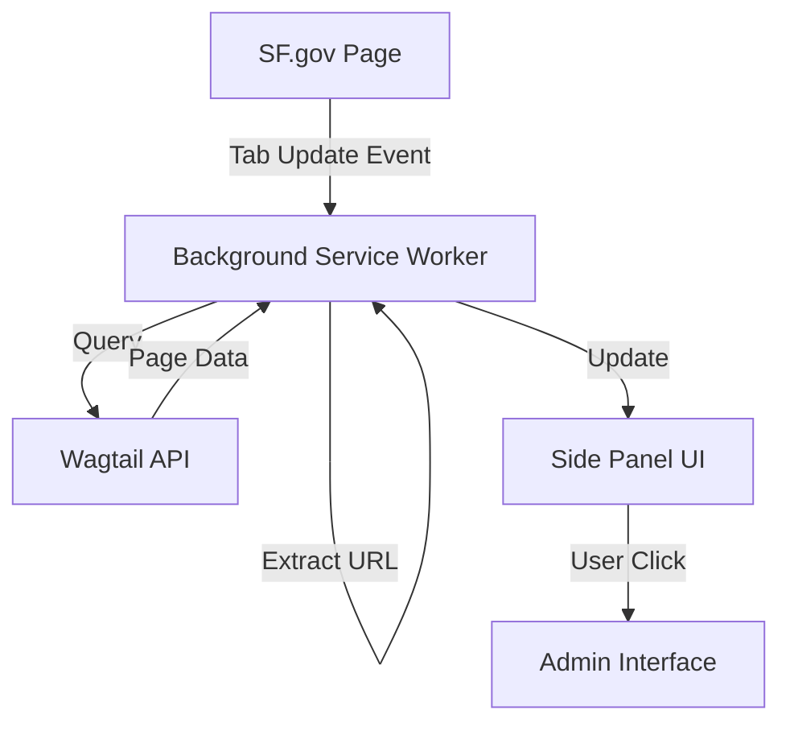
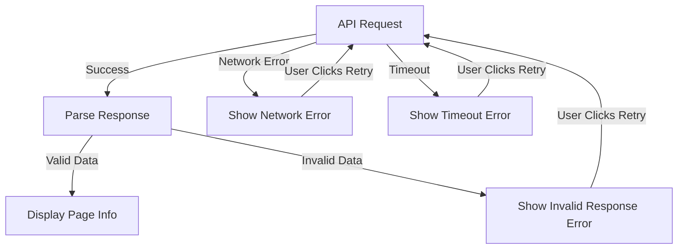

# Design Document

## Overview

The SF.gov Wagtail Extension is a cross-browser extension built with CRXJS that provides content management metadata and administrative links for SF.gov pages. The extension uses the browser's side panel API to display information retrieved from the Wagtail CMS public API, enabling content editors to quickly access editing interfaces and view page metadata.

The extension follows a background service worker architecture that uses tab permissions to monitor navigation events on SF.gov pages. The background worker listens for tab updates, handles API communication, and manages the side panel state without requiring content scripts.

## Architecture

### High-Level Architecture



### Component Structure

```
extension/
├── manifest.json           # Extension configuration
├── src/
│   ├── background/
│   │   └── service-worker.ts    # Background service worker
│   ├── sidepanel/
│   │   ├── sidepanel.html       # Side panel UI
│   │   ├── sidepanel.ts         # Side panel logic
│   │   └── sidepanel.css        # Side panel styles
│   ├── api/
│   │   └── wagtail-client.ts    # Wagtail API client
│   └── types/
│       └── wagtail.ts           # TypeScript types for API responses
└── public/
    └── icons/                   # Extension icons
```

## Components and Interfaces

### 1. Background Service Worker (`service-worker.ts`)

**Purpose:** Monitors tab navigation events and orchestrates communication between the Wagtail API and the side panel.

**Responsibilities:**
- Listen for tab update events via `chrome.tabs.onUpdated`
- Extract URL and slug from tab information
- Manage side panel state (open/close)
- Coordinate API requests through WagtailClient
- Handle cross-component messaging
- Implement domain filtering logic

**Key Functions:**
```typescript
function handleTabUpdate(tabId: number, changeInfo: any, tab: chrome.tabs.Tab): Promise<void>
function extractPageSlug(url: string): string
function isOnSfGov(url: string): boolean
function handlePageChange(slug: string, tabId: number): Promise<void>
function openSidePanel(tabId: number): Promise<void>
function closeSidePanel(tabId: number): Promise<void>
```

**Event Listeners:**
- `chrome.tabs.onUpdated` - Detects navigation to SF.gov pages
- `chrome.tabs.onActivated` - Handles tab switching
- `chrome.runtime.onMessage` - Receives messages from side panel

**Communication:**
- Listens to browser tab events
- Sends messages to side panel with page data
- Calls WagtailClient for API operations

### 2. Wagtail API Client (`wagtail-client.ts`)

**Purpose:** Encapsulates all communication with the Wagtail API.

**Responsibilities:**
- Query pages by slug
- Parse API responses
- Handle errors and timeouts
- Extract relevant metadata from responses

**Key Functions:**
```typescript
async function findPageBySlug(slug: string): Promise<WagtailPage | null>
function parsePageData(response: ApiResponse): WagtailPage
function extractImages(pageData: any): MediaAsset[]
function extractFiles(pageData: any): MediaAsset[]
function extractTranslations(pageData: any): Translation[]
```

**API Endpoints Used:**
- `GET https://api.sf.gov/api/v2/pages/?slug={slug}` - Find page by slug
- Query parameters: `fields=*` to get all page data including custom fields

**Error Handling:**
- 10-second timeout on all requests
- Retry logic for network errors
- Specific handling for 404, 500 status codes

### 3. Side Panel UI (`sidepanel.html`, `sidepanel.ts`)

**Purpose:** Display page metadata and administrative links to the user.

**Responsibilities:**
- Render page information in a user-friendly format
- Display edit links and metadata
- Handle user interactions (clicks, retry actions)
- Show loading and error states

**UI Sections:**
1. **Page Header** - Page title and content type
2. **Edit Links** - Primary edit link and translation links
3. **Metadata** - Partner agency, content type details
4. **Media Assets** - Lists of images and files
5. **Error Display** - Error messages with retry option

**Key Functions:**
```typescript
function renderPageInfo(pageData: WagtailPage): void
function renderEditLink(pageId: number): void
function renderTranslations(translations: Translation[]): void
function renderMediaAssets(images: MediaAsset[], files: MediaAsset[]): void
function showError(error: ApiError): void
function showLoading(): void
```

**Communication:**
- Receives messages from background worker with page data
- Sends retry requests back to background worker

## Data Models

### WagtailPage

```typescript
interface WagtailPage {
  id: number;
  title: string;
  slug: string;
  contentType: string;
  partnerAgency?: string;
  translations: Translation[];
  images: MediaAsset[];
  files: MediaAsset[];
  editUrl: string;
  meta: {
    type: string;
    detailUrl: string;
    htmlUrl: string;
  };
}
```

### Translation

```typescript
interface Translation {
  language: string;
  languageCode: string;
  pageId: number;
  editUrl: string;
  title: string;
}
```

### MediaAsset

```typescript
interface MediaAsset {
  id: number;
  title: string;
  url: string;
  type: 'image' | 'document';
  filename?: string;
}
```

### ApiError

```typescript
interface ApiError {
  type: 'network' | 'timeout' | 'not_found' | 'server_error';
  message: string;
  statusCode?: number;
  retryable: boolean;
}
```

### Message Types

```typescript
// Background -> Side Panel
interface PageDataMessage {
  type: 'PAGE_DATA';
  data: WagtailPage | null;
  error?: ApiError;
}

// Side Panel -> Background
interface RetryMessage {
  type: 'RETRY_FETCH';
  slug: string;
}

interface GetCurrentPageMessage {
  type: 'GET_CURRENT_PAGE';
}
```

## Error Handling

### Error Categories

1. **Network Errors**
   - Display: "Unable to connect to Wagtail API. Check your network connection."
   - Action: Show retry button
   - Retryable: Yes

2. **Timeout Errors**
   - Display: "Request timed out after 10 seconds."
   - Action: Show retry button
   - Retryable: Yes

3. **404 Not Found**
   - Display: "This page is not found in the CMS."
   - Action: None (informational)
   - Retryable: No

4. **500 Server Error**
   - Display: "CMS server error. Please try again later."
   - Action: Show retry button
   - Retryable: Yes

5. **Invalid Response**
   - Display: "Received invalid data from API."
   - Action: Show retry button
   - Retryable: Yes

### Error Handling Flow



### Timeout Implementation

```typescript
async function fetchWithTimeout(url: string, timeout: number = 10000): Promise<Response> {
  const controller = new AbortController();
  const timeoutId = setTimeout(() => controller.abort(), timeout);
  
  try {
    const response = await fetch(url, { signal: controller.signal });
    clearTimeout(timeoutId);
    return response;
  } catch (error) {
    clearTimeout(timeoutId);
    if (error.name === 'AbortError') {
      throw new ApiError('timeout', 'Request timed out');
    }
    throw error;
  }
}
```

## Testing Strategy

### Unit Tests

1. **Wagtail Client Tests**
   - Test slug extraction from URLs
   - Test API response parsing
   - Test error handling for various status codes
   - Test timeout behavior
   - Test media asset extraction

2. **URL Detection Tests**
   - Test SF.gov domain detection
   - Test slug extraction from various URL formats
   - Test handling of URLs with query parameters

3. **Data Transformation Tests**
   - Test conversion of API responses to internal models
   - Test handling of missing optional fields
   - Test translation data extraction

### Integration Tests

1. **Background Worker Integration**
   - Test tab update event handling
   - Test coordination between tab events and API client
   - Test side panel state management
   - Test message routing to side panel
   - Test activation on SF.gov pages only

3. **API Integration**
   - Test real API calls to https://api.sf.gov/api/v2/
   - Test handling of actual API response formats
   - Test error scenarios with real endpoints

### Manual Testing

1. **Cross-Browser Testing**
   - Test in Chrome, Firefox, and Edge
   - Verify side panel behavior in each browser
   - Test extension installation and permissions

2. **User Flow Testing**
   - Navigate to various SF.gov pages
   - Verify correct page data is displayed
   - Test edit link navigation
   - Test error states and retry functionality

3. **Performance Testing**
   - Measure API response times
   - Test behavior with slow network connections
   - Verify 3-second display requirement is met

## Browser Compatibility

### Side Panel API Support

- **Chrome/Edge:** Use `chrome.sidePanel` API (Manifest V3)
- **Firefox:** Use sidebar action API with similar behavior

### Manifest Configuration

```json
{
  "manifest_version": 3,
  "name": "SF.gov Wagtail Extension",
  "version": "1.0.0",
  "permissions": [
    "sidePanel",
    "tabs",
    "storage"
  ],
  "host_permissions": [
    "*://*.sf.gov/*",
    "https://api.sf.gov/*"
  ],
  "background": {
    "service_worker": "src/background/service-worker.ts"
  },
  "side_panel": {
    "default_path": "src/sidepanel/sidepanel.html"
  }
}
```

## Security Considerations

1. **API Access**
   - Only access public Wagtail API endpoints
   - No authentication tokens stored
   - Use HTTPS for all API requests

2. **Content Security Policy**
   - Restrict script sources to extension bundle
   - No inline scripts in HTML
   - No eval() usage

3. **Permissions**
   - Request minimal permissions
   - Limit host permissions to sf.gov and api.sf.gov
   - No access to browsing history or other sensitive data

## Performance Considerations

1. **API Caching**
   - Cache page data for 5 minutes to reduce API calls
   - Invalidate cache on URL change
   - Store cache in memory (not persistent storage)

2. **Lazy Loading**
   - Load side panel UI only when activated
   - Defer non-critical data fetching

3. **Debouncing**
   - Debounce URL change events (300ms) to avoid excessive API calls during navigation

## Future Enhancements

1. **Offline Support**
   - Cache recently viewed pages for offline access
   - Show cached data with staleness indicator

2. **Bulk Operations**
   - Select multiple pages for batch operations
   - Export page metadata to CSV

3. **Custom Filters**
   - Filter pages by partner agency
   - Filter by content type
   - Search across multiple pages

4. **Safari Support**
   - Adapt to Safari's extension APIs
   - Handle Safari-specific side panel behavior
