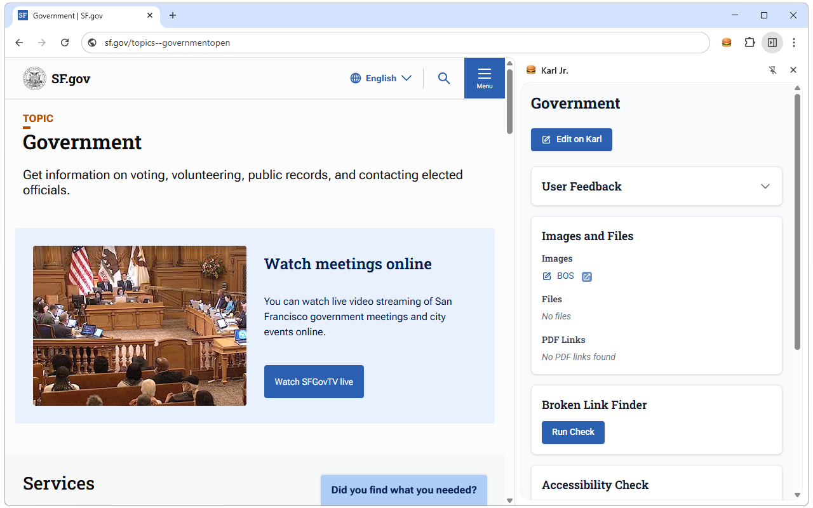

# Karl Jr. (SF.gov Companion Extension)



A cross-browser extension that provides content management information for SF.gov pages. The extension displays a side panel when users navigate SF.gov pages, showing metadata and administrative links retrieved from the Wagtail CMS API.

## Monorepo Structure

This project is organized as an npm workspaces monorepo with three packages:

```
sf-gov-companion/
├── packages/
│   ├── extension/          # Browser extension workspace
│   │   ├── src/
│   │   │   ├── api/        # Wagtail API client
│   │   │   ├── assets/     # Static assets
│   │   │   ├── background/ # Background service worker
│   │   │   ├── sidepanel/  # Side panel UI (React app)
│   │   │   │   ├── components/ # React components
│   │   │   │   └── hooks/  # Custom React hooks
│   │   │   └── types/      # TypeScript type definitions
│   │   ├── public/         # Public assets (icons, etc.)
│   │   ├── dist/           # Build output (generated)
│   │   ├── release/        # Distribution zip files (generated)
│   │   ├── package.json    # Extension dependencies
│   │   ├── vite.config.ts  # Vite build configuration
│   │   ├── tailwind.config.ts # Tailwind CSS configuration
│   │   └── manifest.config.ts # Extension manifest configuration
│   │
│   ├── server/             # Vercel API workspace
│   │   ├── api/            # Serverless functions
│   │   │   ├── feedback.ts # User feedback proxy endpoint
│   │   │   └── link-check.ts # Server-side link checking (SSE)
│   │   ├── lib/            # Shared utilities (auth, logging)
│   │   ├── dev-server.ts   # Lightweight local dev server
│   │   ├── package.json    # API dependencies
│   │   ├── tsconfig.json   # TypeScript configuration
│   │   └── vercel.json     # Vercel configuration
│   │
│   └── shared/             # Shared types workspace
│       ├── src/
│       │   ├── types/      # Shared TypeScript types
│       │   │   ├── wagtail.ts   # Wagtail API types
│       │   │   ├── airtable.ts  # Airtable API types
│       │   │   └── index.ts
│       │   └── index.ts    # Main export file
│       ├── package.json    # Shared package config
│       └── tsconfig.json   # TypeScript configuration
│
├── .kiro/                  # Kiro AI assistant configuration
│   ├── specs/              # Feature specifications
│   └── steering/           # AI assistant steering rules
├── node_modules/           # Hoisted dependencies
├── package.json            # Root workspace configuration
├── tsconfig.json           # Root TypeScript configuration
└── README.md               # This file
```

## Development

### Setup

Install dependencies for all workspaces:

```bash
npm install
```

This will install dependencies for all workspaces and link them together.

### Development Mode

For local development, you need to run both the extension and server:

1. **Start the API server** (in one terminal):
   ```bash
   cd packages/server
   npm run dev
   ```
   This starts a lightweight Node dev server on `http://localhost:3000`.
   
   > **Note:** There's also `npm run dev:vercel` which uses `vercel dev`, but it has significant performance issues on Windows (5+ second response delays due to a libuv bug). The Node dev server is recommended for local development.

2. **Configure the extension** to use the local API:
   ```bash
   cd packages/extension
   cp .env.example .env.local
   ```
   The `.env.local` file should contain:
   ```
   VITE_API_BASE_URL=http://localhost:3000
   ```

3. **Start the extension dev server** (in another terminal):
   ```bash
   npm run dev:extension
   ```

4. **Load the extension** in Chrome:
   - Navigate to `chrome://extensions/`
   - Enable "Developer mode"
   - Click "Load unpacked"
   - Select the `packages/extension/dist/` directory

The extension will now use your local API server instead of the production Vercel deployment.

**Individual workspace dev servers:**
```bash
# Extension only (Vite dev server with HMR)
npm run dev:extension

# API server (lightweight Node server on port 3000)
cd packages/server && npm run dev

# API via Vercel dev (slower on Windows)
cd packages/server && npm run dev:vercel
```

### Build

Build all workspaces:

```bash
npm run build
```

Or build individual workspaces:

```bash
# Extension only
npm run build:extension

# API only
npm run build:server
```

The extension build output will be in `packages/extension/dist/` with a distribution zip in `packages/extension/release/`.

### Load Extension in Browser

1. Build the extension: `npm run build:extension`
2. Open Chrome and navigate to `chrome://extensions/`
3. Enable "Developer mode"
4. Click "Load unpacked"
5. Select the `packages/extension/dist/` directory

## Working with Workspaces

### Adding Dependencies

Add dependencies to specific workspaces using the `--workspace` flag:

```bash
# Add a dependency to the extension
npm install <package-name> --workspace=@sf-gov/extension

# Add a dev dependency to the extension
npm install <package-name> --save-dev --workspace=@sf-gov/extension

# Add a dependency to the API
npm install <package-name> --workspace=@sf-gov/server

# Add a dependency to shared types
npm install <package-name> --workspace=@sf-gov/shared
```

### Running Workspace Scripts

Run scripts in specific workspaces:

```bash
# Run a script in the extension workspace
npm run <script-name> --workspace=@sf-gov/extension

# Run a script in the API workspace
npm run <script-name> --workspace=@sf-gov/server
```

### Type Checking

Check types across all workspaces:

```bash
npm run type-check
```

Or check types in a specific workspace:

```bash
npm run type-check --workspace=@sf-gov/extension
```

## Workspace Details

### Extension Workspace (`@sf-gov/extension`)

The browser extension built with React, Vite, and CRXJS. Contains the side panel UI and background service worker.

**Key Scripts:**
- `npm run dev:extension` - Start Vite dev server with HMR
- `npm run build:extension` - Build production extension
- `npm run preview` - Preview production build
- `npm run release` - Build and package for distribution

**Dependencies:**
- React 19 for UI components
- Vite 7 with CRXJS plugin for extension development
- Tailwind CSS 4 for styling
- `@sf-gov/shared` for shared types

### API Workspace (`@sf-gov/server`)

Vercel serverless functions for the feedback proxy and link checking endpoints. Handles Wagtail session authentication and Redis caching.

**Key Scripts:**
- `npm run dev` - Start lightweight Node dev server (recommended)
- `npm run dev:vercel` - Start Vercel dev server (slower on Windows)
- `npm run deploy` - Deploy to Vercel production

**API Endpoints:**
- `/api/feedback` - Proxies user feedback data from Airtable
- `/api/link-check` - Server-side link validation with SSE streaming

**Dependencies:**
- `@vercel/node` for serverless function runtime
- `@upstash/redis` for session caching
- `tsx` for local TypeScript execution
- `@sf-gov/shared` for shared types

### Shared Workspace (`@sf-gov/shared`)

Common TypeScript types and interfaces used by both extension and API workspaces.

**Exports:**
- Wagtail API types
- Airtable API types
- Common utility types

## TypeScript Configuration

The project uses TypeScript with strict mode enabled across all workspaces:

- `strict: true` - Enables all strict type checking options
- `noUnusedLocals: true` - Reports errors on unused local variables
- `noUnusedParameters: true` - Reports errors on unused parameters
- `noFallthroughCasesInSwitch: true` - Reports errors for fallthrough cases in switch statements

Each workspace extends the root `tsconfig.json` for consistent configuration.

## Technology Stack

### Extension
- **CRXJS**: Chrome extension framework with Vite integration
- **TypeScript 5.9**: Type-safe JavaScript
- **React 19**: UI library for side panel
- **Vite 7**: Build tool and development server
- **Tailwind CSS 4**: Utility-first CSS framework

### API
- **Vercel**: Serverless function platform
- **@vercel/node**: Serverless function runtime
- **Upstash Redis**: Serverless Redis database for caching and rate limiting

### Shared
- **TypeScript 5.9**: Type definitions only

## Extension Identification Headers

All requests to `api.sf.gov` include custom headers for logging and tracking:

```
User-Agent: SF-Gov-Companion-Extension/1.0
X-SF-Gov-Extension: companion
```

These headers are sent in:
- **Extension → api.sf.gov**: Direct Wagtail API calls for page data
- **Proxy → api.sf.gov**: Session validation requests
- **Extension → Proxy**: Airtable feedback requests

Server administrators can filter logs using these headers to identify extension traffic.

## Requirements

See `.kiro/specs/monorepo-conversion/requirements.md` for detailed monorepo requirements.

## Documentation

- [React Documentation](https://reactjs.org/)
- [Vite Documentation](https://vitejs.dev/)
- [CRXJS Documentation](https://crxjs.dev/vite-plugin)
